<h1 align="center">InkTime Watch</h1>

<br>
<br>

This document presents the design and implementation details of the InkTime smartwatch project, covering both the hardware architecture and mechanical integration.

In the following sections, you will find comprehensive documentation including the schematic, PCB layout, component selection, and 3D assembly of the device.

<br> 

## Block Diagram

```text

                                +----------------------+
                                |        USB-C         |
                                |   Power / USB Data   |
                                +----------+-----------+
                                           |
                                           v
                                +----------------------+
                                |   ESD Protection     |
                                |    USBLC6-2SC6Y      |
                                +----------+-----------+
                                           |
                                           v
                                +----------------------+
                                |   Li-Po Charger      |
                                |    BQ25180YBGR       |
                                +----+------------+----+
                                     |            |
                                     |            +--------------------+
                                     |                                 |
                                     v                                 v
                           +-------------------+             +-------------------+
                           |   Li-Po Battery   |             |   Fuel Gauge      |
                           |     LP502030      |<-- I2C ---> |    MAX17048       |
                           +---------+---------+             +-------------------+
                                     |
                                     v
                           +-------------------+
                           | Buck-Boost DC/DC  |
                           |    RT6160AWSC     |
                           +---------+---------+
                                     |
                                   3V3 / VREG
                                     |
        +----------------------------+------------------------------+
        |                            |                              |
        v                            v                              v
+---------------+          +-------------------+          +-------------------+
|   nRF52840    |<--I2C--->|      BMA421       |<--I2C--->|     DRV2605       |
|   BLE MCU     |          |       IMU         |          |   Haptic Driver   |
+-------+-------+          +-------------------+          +---------+---------+
        |                                                              |
        | SPI + GPIO                                                    v
        v                                                      +----------------+
+-------------------+                                          | Vibration Motor|
| 1.54" E-Paper     |                                          |     (Shaker)   |
| via FPC Connector |                                          +----------------+
+-------------------+
        |
        +--> Dedicated E-Paper Power Stage:
             MOSFETs + Schottky Diodes + Inductors + Capacitors


```


## Hardware Functionality


###  Microcontroller

The system is built around a Nordic **nRF52840** SoC  
*(Arm Cortex-M4F @ 64 MHz, 1 MB Flash, 256 kB RAM)*.

This component was chosen because it integrates:
- a **2.4 GHz radio (Bluetooth Low Energy)**
- a **USB 2.0 full-speed controller**

 This allows both:
- wireless communication (BLE)
- USB-C data connectivity  

without requiring any external transceiver.

The MCU operates using two external crystals:
- **32 MHz HF crystal (XC1/XC2)** → CPU + radio
- **32.768 kHz LF crystal (XL1/XL2)** → RTC + low-power timing  

> Accurate timekeeping is critical for a watch, therefore the LFXO is mandatory.

An on-board **2.4 GHz chip antenna (2450AT18B100E)** is:
- placed at the edge of the PCB  
- isolated via a **ground keep-out zone**  

The antenna is connected to the `ANT` pin through a matching network.

---

### Display — E-Paper (SPI)

A reflective **e-paper display** is controlled via the SPI interface:

- `SCK` → P0.02  
- `MOSI` → P0.03  
- `CS` → P0.05  

Additional control signals:
- `EPD_DC` (P0.15) → command/data selection  
- `EPD_RST` (P0.16) → hardware reset  
- `EPD_BUSY` (P0.17) → busy status input  

The display is connected using a **24-pin FPC connector**.

#### Power Optimization
E-paper displays consume power **only during refresh**.

To optimize energy consumption:
- the display power rail is gated using a **PFET**
- controlled by `P1.01`

This allows:
- complete power shutdown between updates  
- significantly extended battery life (days instead of hours)

---

### IMU — BMA421 (I²C)

The **Bosch BMA421** accelerometer provides:
- 3-axis acceleration data  
- built-in **step counting functionality**

Connected via the shared I²C bus.

Interrupt lines:
- `IMU_INT1` → P0.08  
- `IMU_INT2` → P1.08  

These allow:
- wake-up from deep sleep  
- event-driven processing (no polling required)

---

### Haptics — DRV2605 (I²C)

The **TI DRV2605L** controls a vibration motor (LRA/ERM).

Key features:
- I²C configuration interface  
- internal ROM with predefined haptic effects  

The MCU only sends:
> “play effect N” commands  

instead of generating waveforms.

Control signal:
- `HAPTIC_EN` → P0.12  

Allows full shutdown of the driver when idle.

---

### Power Management  
**BQ25180 + MAX17048 + RT6160**

#### USB Input
- USB-C provides **5V input**
- protected by **USBLC6-2SC6Y (ESD protection)**
- includes **5.1 kΩ CC pull-down resistors** → device configured as sink

---

#### Battery Charging — BQ25180
Handles:
- Li-Po charging (CC/CV)
- power path management (USB ↔ battery switching)

Communication:
- I²C interface
- interrupt line: `PMIC_INT` → P0.11  

---

#### Voltage Regulation — RT6160
- Buck-boost converter generating stable **3.3V (VREG)**

Why buck-boost:
- battery range: **3.0V – 4.2V**
- ensures stable output across full discharge cycle

---

#### Fuel Gauge — MAX17048
Provides:
- battery percentage
- voltage monitoring

Uses **ModelGauge algorithm**:
- no current sense resistor required

Communication:
- I²C interface  
- `ALERT` → P1.10 (threshold events)

---

### Inputs — Buttons

Three user buttons connected as:
- `P0.13`
- `P0.14`
- `P1.02`

Characteristics:
- active-low configuration  
- RC debounce  
- internal pull-ups used  

Support:
- GPIOTE interrupts  
- wake-up from System OFF

---

### Shared I²C Bus

All I²C peripherals share the same bus:

Devices:
- BMA421 (IMU)
- MAX17048 (fuel gauge)
- DRV2605L (haptics)
- BQ25180 (charger)

Bus lines:
- `SDA` → P0.06  
- `SCL` → P0.07  

Pull-ups:
- **3.3 kΩ to 3V3**

Operating mode:
- **400 kHz (Fast Mode)**

Sufficient for low-bandwidth sensor communication.

---

### Debug Interface

Programming and debugging via SWD:

- `SWDCLK`
- `SWDIO`
- optional `SWO` → P1.00  

Connector:
- **Tag-Connect TC2030 footprint**

Advantage:
- no bulky header required (important for wearable design)

---

### Expected Capabilities

Based on this hardware, the system supports:

- accurate timekeeping using RTC + LFXO  
- rendering UI on e-paper display  
- step detection & gesture sensing  
- haptic feedback via vibration motor  
- BLE communication with a smartphone  
- USB connectivity for power and data  
- real-time battery monitoring  

The design enables a **low-power wearable device** with multi-day battery life.


## Pinout Table

| Pin | Signal | Direction | Peripheral | Description |
|-----|--------|-----------|------------|-------------|
| P0.02 | SPI_SCK | Output | E-Paper Display | SPI clock |
| P0.03 | SPI_MOSI | Output | E-Paper Display | SPI data out |
| P0.05 | EPD_CS | Output | E-Paper Display | Chip select |
| P0.06 | SDA | Bidir | Fuel Gauge, Charger, IMU, Haptics | Shared I2C data |
| P0.07 | SCL | Output | Fuel Gauge, Charger, IMU, Haptics | Shared I2C clock |
| P0.08 | IMU_INT1 | Input | IMU (BMA421) | Interrupt line 1 |
| P0.11 | PMIC_INT | Input | Charger (BQ25180) | Fault/status interrupt |
| P0.12 | HAPTIC_EN | Output | Haptics (DRV2605) | Driver enable |
| P0.13 | — | Input | Button 1 | User button |
| P0.14 | — | Input | Button 2 | User button |
| P0.15 | EPD_DC | Output | E-Paper Display | Data/command select |
| P0.16 | EPD_RST | Output | E-Paper Display | Display reset |
| P0.17 | EPD_BUSY | Input | E-Paper Display | Busy status |
| P0.18 | RESET | Input | — | System reset |
| P1.00 | SWO | Output | Debug (pad) | SWD trace output |
| P1.01 | — | Output | EPD power gate | EPD power control |
| P1.02 | — | Input | Button 3 | User button |
| P1.08 | IMU_INT2 | Input | IMU (BMA421) | Interrupt line 2 |
| P1.10 | ALERT | Input | Fuel Gauge (MAX17048) | UV/OV alert |
| D+ | D+ | Bidir | USB-C connector | USB data+ |
| D− | D- | Bidir | USB-C connector | USB data− |
| XL1/XL2 | — | — | 32.768 kHz crystal | Low-frequency clock |
| XC1/XC2 | — | — | 32 MHz crystal | High-frequency clock |
| SWDCLK | SWDCLK | Input | Debug (pad) | SWD clock |
| SWDIO | SWDIO | Bidir | Debug (pad) | SWD data |
| ANT | RF | Output | 2.4 GHz antenna | Wireless antenna feed |

## Bill of Materials (BOM)

| Part Name | Qty | Link (Order + Datasheet) |
| :-- | :--: | :--: |
| NRF52840-QIAA-R7 | 1 | [Link](https://jlcpcb.com/partdetail/NordicSemicon-NRF52840_QIAAR7/C1851953) |
| BMA421 | 1 | [Link](https://jlcpcb.com/partdetail/BoschSensortec-BMA421/C5242966) |
| DRV2605YZFR | 1 | [Link](https://jlcpcb.com/partdetail/TexasInstruments-DRV2605YZFR/C81079) |
| BQ25180YBGR | 1 | [Link](https://jlcpcb.com/partdetail/TexasInstruments-BQ25180YBGR/C3682423) |
| MAX17048G+T10 | 1 | [Link](https://jlcpcb.com/partdetail/2777647-MAX17048GT10/C2682616) |
| RT6160AWSC | 1 | [Link](https://jlcpcb.com/partdetail/RichtekTech-RT6160AWSC/C7065276) |
| USBLC6-2SC6Y | 1 | [Link](https://jlcpcb.com/partdetail/TECHPUBLIC-USBLC62SC6Y/C5310974) |
| KH-TYPE-C-16P | 1 | [Link](https://jlcpcb.com/partdetail/Shenzhen_KinghelmElec-KH_TYPE_C16P/C709357) |
| 2450AT18B100E | 1 | [Link](https://jlcpcb.com/partdetail/JohansonDielectrics-2450AT18B100E/C2917717) |
| SI1308EDL-T1-GE3 | 1 | [Link](https://jlcpcb.com/partdetail/VishayIntertech-SI1308EDL_T1GE3/C469327) |
| DMG2305UX-7 | 1 | [Link](https://jlcpcb.com/partdetail/DiodesIncorporated-DMG2305UX7/C150470) |
| 5034802400 | 1 | [Link](https://jlcpcb.com/partdetail/MOLEX-5034802400/C122434) |
| EVPAKE31A | 3 | [Link](https://jlcpcb.com/partdetail/PANASONIC-EVPAKE31A/C569760) |
| NX2016SA-32MHZ-STD-CZS-5 | 1 | [Link](https://jlcpcb.com/partdetail/NDK-NX2016SA_32MHZ_STD_CZS5/C843260) |
| CM8V-T1A-32.768KHZ-9PF-20PPM-TB-QA | 1 | [Link](https://jlcpcb.com/partdetail/C5366546) |
| SDFL1608S100KTF | 1 | [Link](https://jlcpcb.com/partdetail/Sunlord-SDFL1608S100KTF/C1035) |
| SDCL1005C15NJTDF | 1 | [Link](https://jlcpcb.com/partdetail/Sunlord-SDCL1005C15NJTDF/C27143) |
| SDCL1005C3N9STDF | 1 | [Link](https://jlcpcb.com/partdetail/Sunlord-SDCL1005C3N9STDF/C14033) |
| FTC252012SR47MBCA | 1 | [Link](https://jlcpcb.com/partdetail/6763488-FTC252012SR47MBCA/C5832368) |
| 744043680 | 1 | [Link](https://jlcpcb.com/partdetail/WurthElektronik-744043680/C2045671) |
| MBR0530 | 3 | [Link](https://jlcpcb.com/partdetail/78464-MBR0530/C77336) |
| GRM033R61A104KE15D | 5 | [Link](https://jlcpcb.com/partdetail/MurataElectronics-GRM033R61A104KE15D/C76934) |
| GRM155R60J226ME11D | 2 | [Link](https://jlcpcb.com/partdetail/408393-GRM155R60J226ME11D/C415703) |
| GRM155R61H105KE05D | 9 | [Link](https://jlcpcb.com/partdetail/1609005-GRM155R61H105KE05D/C1518208) |
| GRM0335C1H1R0BA01D | 2 | [Link](https://jlcpcb.com/partdetail/MurataElectronics-GRM0335C1H1R0BA01D/C85893) |
| GRM0335C1H101JA01D | 1 | [Link](https://jlcpcb.com/partdetail/MurataElectronics-GRM0335C1H101JA01D/C76922) |
| CGA0402X5R475M250GT | 1 | [Link](https://jlcpcb.com/partdetail/HRE-CGA0402X5R475M250GT/C6119795) |
| CL05A475MP5NRNC | 5 | [Link](https://jlcpcb.com/partdetail/24469-CL05A475MP5NRNC/C23733) |
| CL05A105KA5NQNC | 6 | [Link](https://jlcpcb.com/partdetail/53938-CL05A105KA5NQNC/C52923) |
| CL05A106MQ5NUNC | 3 | [Link](https://jlcpcb.com/partdetail/16204-CL05A106MQ5NUNC/C15525) |
| CC0201KRX5R7BB473 | 1 | [Link](https://jlcpcb.com/partdetail/YAGEO-CC0201KRX5R7BB473/C505465) |
| 0201X104K100NT | 5 | [Link](https://jlcpcb.com/partdetail/270391-0201X104K100NT/C284966) |
| 0201WMF220KTEE | 1 | [Link](https://jlcpcb.com/partdetail/479910-0201WMF220KTEE/C473517) |
| 0201WMJ0000TEE | 3 | [Link](https://jlcpcb.com/partdetail/259867-0201WMJ0000TEE/C270337) |
| 0201WMJ0332TEE | 2 | [Link](https://jlcpcb.com/partdetail/259848-0201WMJ0332TEE/C270318) |
| 0201CG120J500NT | 4 | [Link](https://jlcpcb.com/partdetail/51400-0201CG120J500NT/C50391) |
| CR0201FH5101G | 2 | [Link](https://jlcpcb.com/partdetail/LIZElec-CR0201FH5101G/C100142) |
| CPF0201D10KC1 | 6 | [Link](https://jlcpcb.com/partdetail/TEConnectivity-CPF0201D10KC1/C4187156) |
| UCR006YVPFLR470 | 1 | [Link](https://jlcpcb.com/partdetail/ROHMSemicon-UCR006YVPFLR470/C2089071) |


## Design Details

### Schematic and Components

The reference schematic was carefully reviewed and validated against the datasheets of each individual component. Any inconsistencies identified during this process were analyzed and corrected, most of them originating from outdated reference designs used in the initial schematic.

---

### PCB Layout and Routing

The PCB was designed in accordance with the manufacturing constraints specified by JLCPCB for standard rigid PCB assembly.

A ground pour was implemented on the top layer and connected to the main ground plane using via stitching. Additional manual stitching was applied in sensitive areas, particularly around the antenna feed line, to improve signal integrity.

Teardrops were added to most trace junctions to enhance mechanical reliability. Due to limitations in Fusion when generating teardrops for off-grid or rotated components, some shapes—especially those near the MCU (placed at a 45-degree angle)—were manually refined to ensure proper geometry.

Given the limited available space and the minimum recommended silkscreen text size of 1 mm, an indexed labeling approach was used. Larger components, ICs, and important pads were labeled directly on the silkscreen, while smaller areas rely on the legend.

To ensure mechanical robustness, relatively large internal annular rings were maintained. As a consequence, certain unused pins of the MCU were masked to prevent unintended electrical connections with traces routed underneath.

VIA-in-pad (ViP) technology was used extensively for compact multi-pin SMD components. Any DRC warnings related to ViP clearances were manually reviewed and accepted where appropriate.

Special attention was given to spatial constraints such as:
- antenna keep-out zone
- crystal oscillator trace length
- maximizing distance between the IMU and the shaker motor

Additionally, all decoupling capacitors were placed as close as possible to their respective power pins.

The USB differential pair (D+ and D−) was routed carefully, maintaining approximately equal lengths and minimal spacing between the traces to preserve signal integrity.

---

### 3D Design

Accurate 3D models for all components were integrated into the PCB assembly in order to validate the mechanical design.

The complete enclosure assembly was analyzed to detect any potential mechanical interferences. A possible issue was identified regarding the battery height specified in its datasheet, as the available space in the lower part of the enclosure may be insufficient.

At this stage, the enclosure design was left unchanged, with the intention of validating this aspect during the physical prototyping phase.

## Renders

### PCB 2D
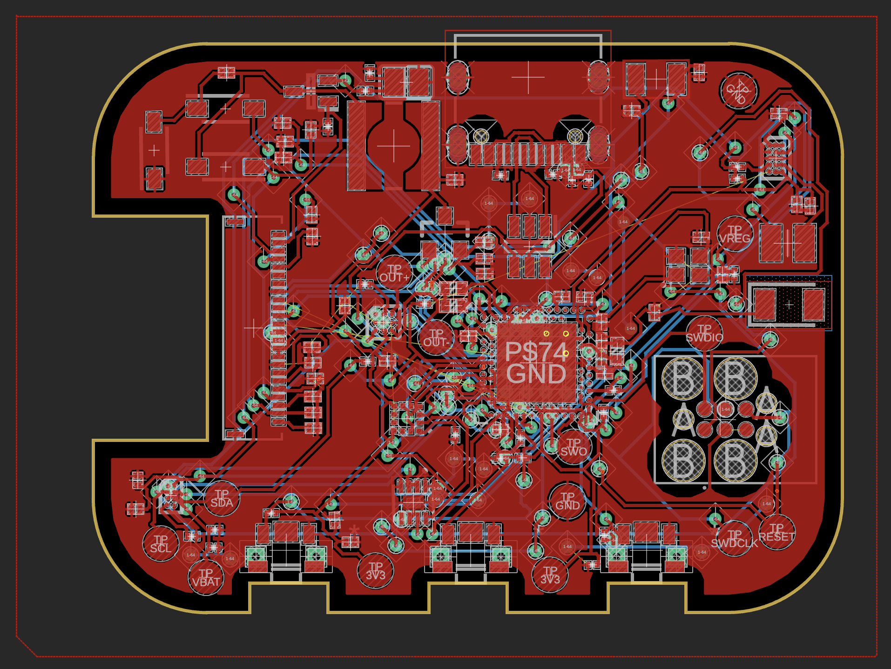
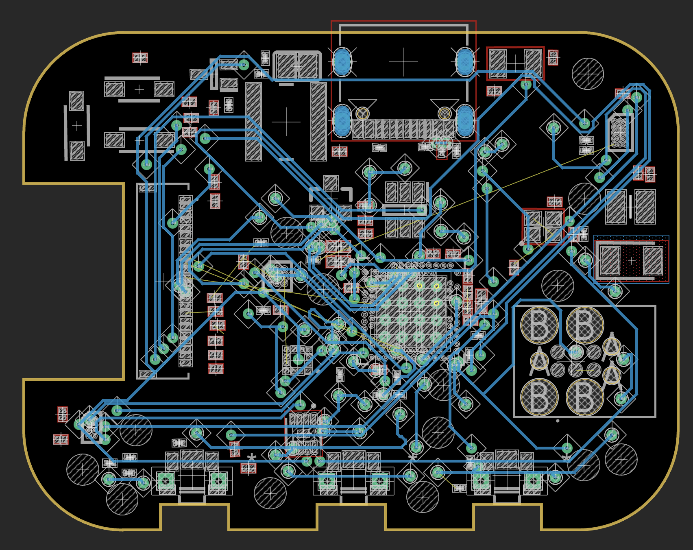

### PCB 3D
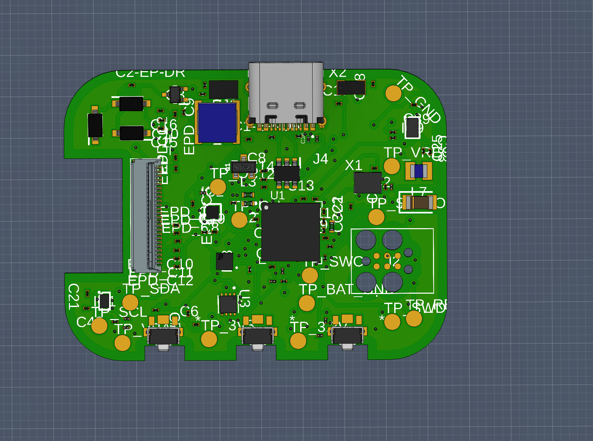
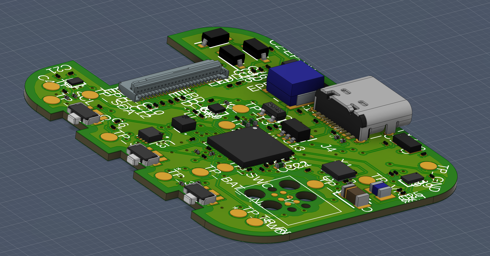

### Assembly
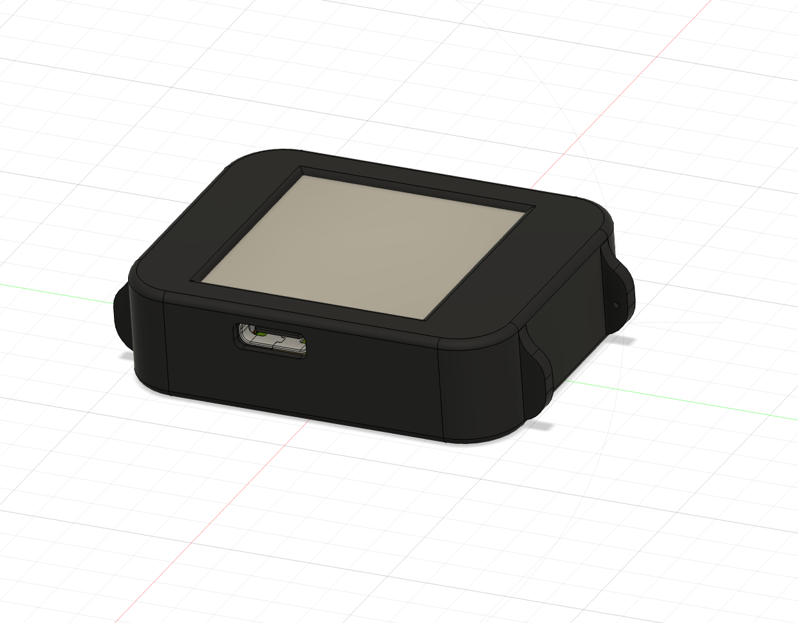
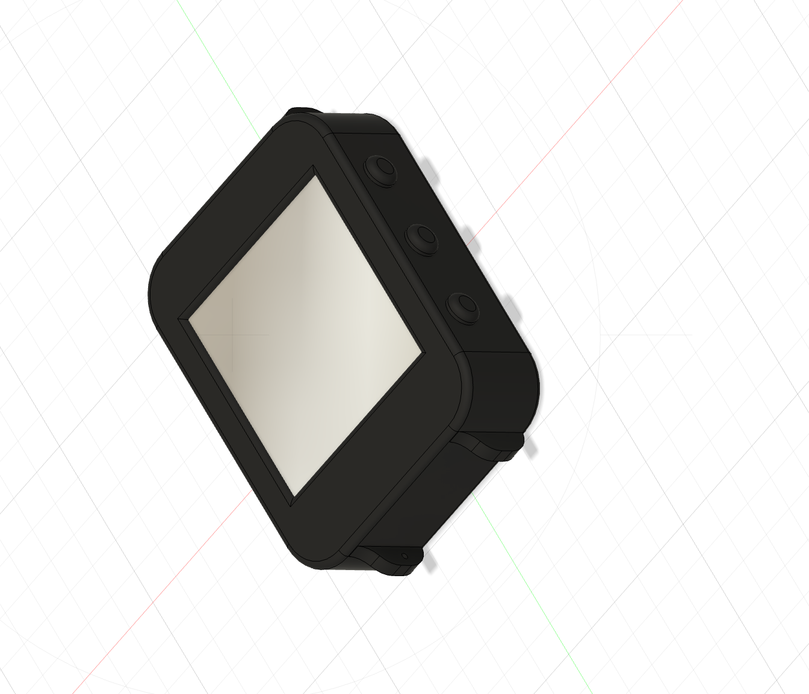

### Exploded View
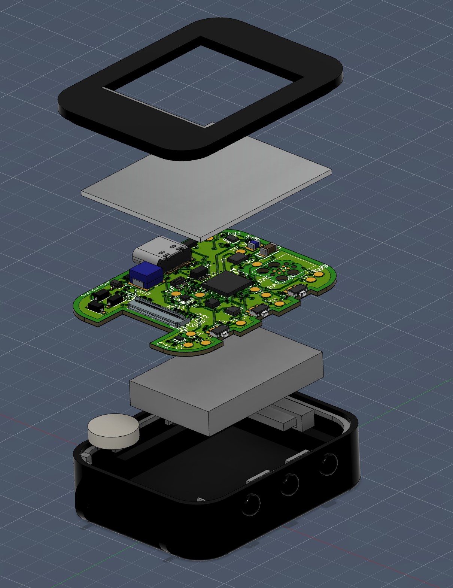
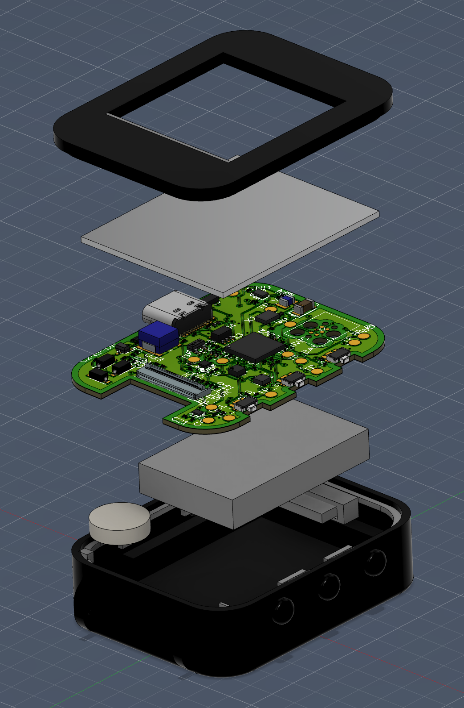

### Without Display
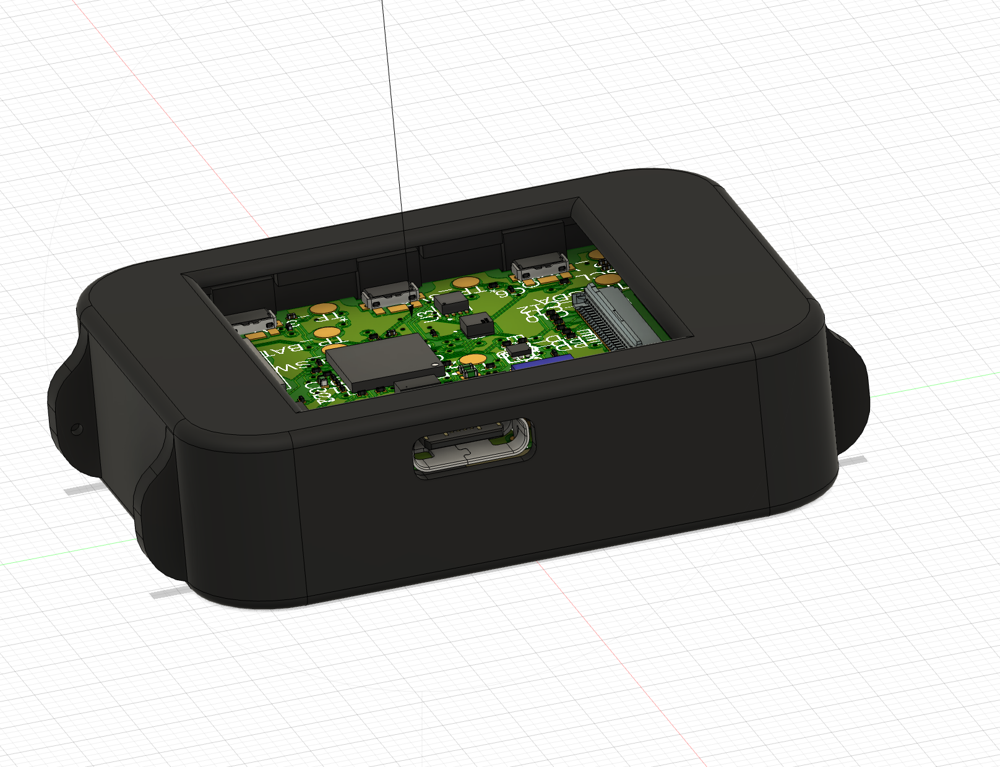
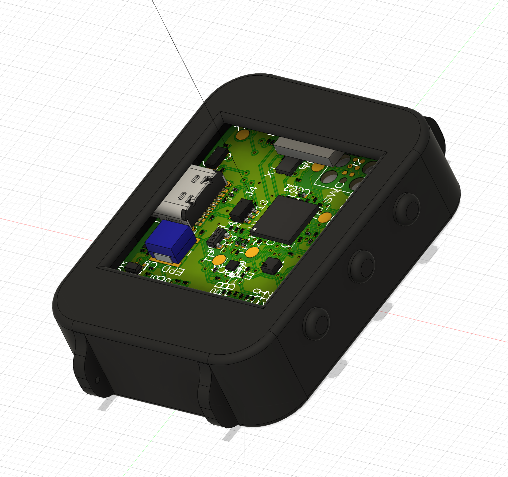
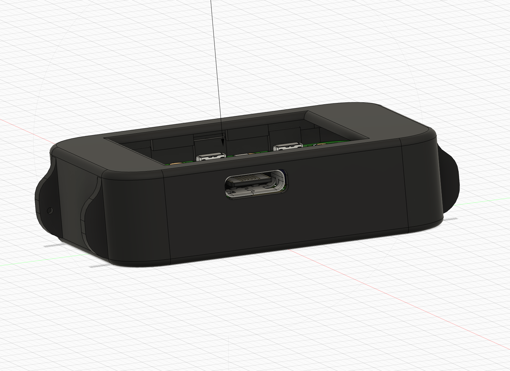
